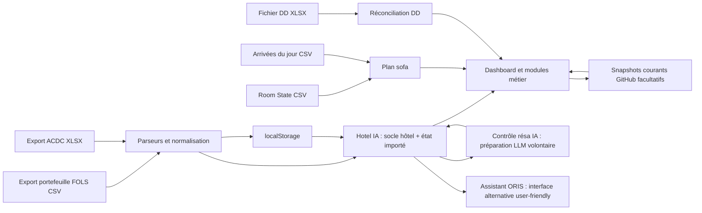

# ORIS — Operational Reality Intelligence System

> Documentation canonique du projet  
> État décrit : implémentation présente dans ce dossier au 13 juillet 2026

Ce document est la **Single Source of Truth** d’ORIS. Il décrit le domaine hôtelier, les règles métier, l’architecture logicielle, les formats de données, les workflows opératoires, les limites connues et la trajectoire prévue. En cas d’écart avec les anciens fichiers `AAR_CONTEXT_V3.txt`, `hotel.txt` ou `module sofa.txt`, l’implémentation actuelle décrite ici fait foi.

---

## Sommaire

1. [Vision du projet](#1-vision-du-projet)
2. [Périmètre et principes de conception](#2-périmètre-et-principes-de-conception)
3. [Référence hôtel](#3-référence-hôtel)
4. [Architecture](#4-architecture)
5. [Modèle Virtual Hotel](#5-modèle-virtual-hotel)
6. [Modèle de données](#6-modèle-de-données)
7. [Pipeline de normalisation](#7-pipeline-de-normalisation)
8. [Modules fonctionnels](#8-modules-fonctionnels)
9. [Règles métier](#9-règles-métier)
10. [Workflows opérationnels](#10-workflows-opérationnels)
11. [Implémentation actuelle, limites et dérives](#11-implémentation-actuelle-limites-et-dérives)
12. [Roadmap](#12-roadmap)
13. [Guide de développement](#13-guide-de-développement)

---

## 1. Vision du projet

ORIS signifie **Operational Reality Intelligence System**.

Le projet transforme des exports PMS et des informations opérationnelles dispersées en un poste de pilotage unique pour la réception. Il ne remplace pas FOLS et n’écrit pas dans le PMS. Il reconstruit une lecture exploitable de la réalité de l’hôtel à partir de fichiers exportés, de règles déterministes et de décisions opérateur.

Le problème métier traité est concret : au desk, les informations nécessaires à une décision sont réparties entre le PMS, les commentaires de réservation, les exports ACDC, les listes de groupes, les états de chambre, les fichiers de débits différés, les mémos et la connaissance implicite des équipes. Cette fragmentation augmente le temps de recherche, les interruptions et le risque d’oubli.

ORIS poursuit quatre objectifs :

- rendre les signaux importants immédiatement visibles ;
- appliquer les mêmes règles de détection à chaque import ;
- externaliser une partie de la charge cognitive du réceptionniste ;
- préparer un modèle hôtel structuré pouvant, à terme, alimenter une véritable couche d’aide à la décision.

La valeur du produit repose d’abord sur la fiabilité des règles et de la donnée, pas sur l’IA générative. Dans l’état actuel, les calculs sont déterministes et auditables.

### 1.1 Utilisateur principal

Le rôle de référence est le **premier de réception**, en poste du matin ou du soir, souvent seul au desk et soumis à de nombreuses interruptions. Il doit simultanément :

- suivre les arrivées et départs ;
- préparer ou corriger les attributions ;
- contrôler les garanties et VCC ;
- anticiper les besoins de sofa et de lit bébé ;
- traiter les préférences ;
- suivre les groupes ;
- transmettre un état clair au poste suivant ;
- rester disponible pour les clients présents.

La contrainte principale n’est donc pas uniquement le volume de données : c’est la **charge cognitive en temps réel**.

Les transmissions et ruptures de rythme historiquement identifiées se situent notamment autour de 08:00 et 19:00. Le milieu de journée comporte aussi des pauses et changements de disponibilité qui rendent indispensable un état écrit, compréhensible sans reconstituer mentalement le poste précédent.

### 1.2 Positionnement

ORIS est actuellement une application web statique, locale et orientée poste de travail. Elle fonctionne par imports de fichiers, persistance dans le navigateur et, pour deux sources seulement, restauration facultative depuis GitHub.

Ce que le produit est aujourd’hui :

- un tableau de bord opérationnel ;
- un ensemble de détecteurs métier ;
- une vue consolidée des données importées ;
- un plan sofa interactif ;
- un outil de réconciliation DD ;
- un socle central nommé « Hotel IA », qui sert de mémoire structurée de l’hôtel et de point de passage pour les futures analyses IA.
- une interface alternative nommée « Assistant », pensée comme façade très user-friendly au-dessus de Hotel IA.

Ce qu’il n’est pas encore :

- un PMS ;
- une base de données centrale ;
- un moteur de réservation ;
- un agent autonome ;
- un système de machine learning ;
- un LLM branché automatiquement sur les imports ;
- un LLM produisant ou exécutant des décisions.

---

## 2. Périmètre et principes de conception

### 2.1 Principes métier

#### Une vérité opérationnelle lisible

Les exports bruts restent les sources externes. ORIS en dérive une lecture opérationnelle sans prétendre modifier la vérité PMS. Lorsqu’une action est effectuée dans FOLS, un nouvel export est nécessaire pour réconcilier ORIS avec le PMS.

#### Déterminisme avant automatisation

Une alerte doit être explicable par une règle identifiable : code tarif ciblé, mot-clé, composition d’occupation, score ACDC, absence de chambre, plage d’attribution ou combinaison de montants.

#### L’humain reste décisionnaire

Le système détecte, regroupe, compte, suggère et mémorise. Les décisions sensibles restent validées par l’opérateur : attribution, surclassement, modification de sofa dans FOLS, remise commerciale, réponse client ou arbitrage de groupe.

#### Réduction des interruptions

Les checklists, listes d’action et regroupements par date doivent éviter de refaire mentalement les mêmes contrôles. Le plan est pensé comme une mémoire de poste et un support de transmission.

#### Préservation de la disponibilité client

L’outil doit diminuer le temps passé à chercher l’information. Une automatisation qui rend le desk moins disponible est contre-productive, même si elle est techniquement correcte.

### 2.2 Principes logiciels

- **Zéro étape de build** : HTML, CSS et JavaScript sont chargés directement.
- **Progressive enhancement local** : les modules partagent le DOM et quelques API globales `window.*`.
- **Tolérance aux variations d’exports** : les parseurs acceptent plusieurs alias de colonnes et formats de date.
- **État explicite** : la configuration et les décisions opérateur sont persistées dans `localStorage`.
- **Échec isolé autant que possible** : plusieurs appels optionnels utilisent des gardes et ne bloquent pas l’ensemble du site.
- **Affichage français** : dates, libellés et workflows sont conçus pour l’exploitation locale.
- **Pas d’historique FOLS local** : seul le portefeuille courant est conservé, afin d’éviter de saturer la mémoire du navigateur.

### 2.3 Hiérarchie des sources de vérité

1. Le PMS et les fichiers opérationnels restent les sources externes.
2. Le code actuel définit le comportement logiciel réel.
3. Ce README documente ce comportement et le domaine.
4. Les réglages enregistrés par l’opérateur peuvent modifier les règles configurables.
5. Les anciens fichiers TXT sont des archives de conception ; ils ne doivent plus être utilisés comme documentation active.

---

## 3. Référence hôtel

### 3.1 Identité

| Propriété | Valeur de référence |
|---|---|
| Hôtel | Novotel Marne-la-Vallée Collégien |
| Marque | Novotel |
| Exploitation | Franchise |
| PMS | FOLS |
| Version PMS historiquement documentée | 7.20.4.10245 |
| Nombre de chambres | 193 |
| Étages | 1 à 4 |
| Région du modèle logiciel | Paris |
| Banque d’ascenseurs | A |

La version FOLS est une information d’exploitation ; elle n’est ni contrôlée ni utilisée par le code.

### 3.2 Typologie de chambres

Le modèle hôtel déclare les catégories suivantes :

| Code | Gamme | Capacité de référence | Sofa théorique |
|---|---|---:|---:|
| `TRI` | Classique | 2 adultes + 1 enfant | 1 |
| `STDM` | Classique | 2 adultes + 2 enfants | 2 |
| `PRIVS` | Supérieure | 2 adultes + 1 enfant | 1 |
| `PRIVM` | Supérieure | 2 adultes + 2 enfants | 2 |
| `SGE` | Executive | 2 adultes + 1 enfant | 1 |
| `EXEC` | Premium | 2 adultes + 2 enfants | 2 |

La capacité théorique ne prouve pas qu’un sofa est actuellement ouvert. Le système distingue toujours :

- le **potentiel** lié à la catégorie de chambre ;
- l’**état réel** issu du Room State/FOLS ;
- le **besoin** calculé depuis la composition des arrivées ;
- la **décision opérateur** matérialisée dans le plan.

### 3.3 Répartition active du plan

Le plan opérationnel embarque 193 chambres :

| Étage | Chambres actives du plan | Nombre | Catégories présentes dans le plan |
|---:|---|---:|---|
| 1 | `TRI` 129–150 ; `PRIVM` 160–186 | 49 | `TRI`, `PRIVM` |
| 2 | `TRI` 220–258 ; `STDM` 260–287 | 67 | `TRI`, `STDM` |
| 3 | `SGE` 320–338, 340 et 342 ; `Exec` 360–387 | 49 | `SGE`, `Exec` |
| 4 | `PRIVM` 460–487 | 28 | `PRIVM` |
| **Total** |  | **193** |  |

Dans le plan, la variante `Exec` est normalisée vers `EXEC` pour les comptages. `PRIVS` existe dans le modèle hôtel, mais aucune chambre du plan embarqué ne porte actuellement ce type.

### 3.4 Ascenseurs et bruit

Le modèle logiciel actif décrit deux ascenseurs :

- `A1`, desservant les étages 1 à 3 ;
- `A2`, desservant les étages 1 à 4.

Le modèle de bruit conserve trois niveaux sémantiques autour de la gaine :

- `direct` : chambre accolée à la gaine ;
- `near` : chambre proche ;
- `low` : impact faible.

La documentation historique citait aussi les repères A5 et A6. Ils ne sont pas représentés dans le modèle ou le plan actuels. Le modèle de bruit n’est pas encore utilisé par un algorithme d’attribution.

### 3.5 Sémantique FOLS utile à l’exploitation

Les conventions opérationnelles documentées restent :

- beige : chambre libre ;
- vert : client présent ;
- jaune : pré-attribution ;
- orange : départ prévu ;
- bleu : hors service ;
- point bleu : hors service futur ;
- clé/outil : sofa réellement déployé ou équipement chambre déclaré ;
- état sale : ménage requis.

Le code ne reproduit pas toutes les couleurs FOLS. Le plan dérive principalement trois modes :

- `blocked` lorsque `RoomState` vaut « Hors Service » ;
- `present` lorsque `Stay` vaut « Présent » et que le départ est postérieur à la date de référence ;
- `free`/« Libérable » dans les autres cas.

### 3.6 Cadre décisionnel du desk

Le premier de réception peut appliquer les procédures définies localement et gérer les ajustements courants. La documentation métier fixe une remise autonome maximale de 10 %. Au-delà, ou pour une décision sensible, l’escalade vers un responsable reste nécessaire.

Les pratiques non officielles ou les arbitrages d’urgence ne doivent pas devenir des automatismes opaques. S’ils sont intégrés à ORIS, ils doivent être transformés en règles explicites, auditables et validées.

---

## 4. Architecture

### 4.1 Vue d’ensemble



Le sens cible est volontairement centralisé : les imports alimentent `Hotel IA`, puis les vues et les futures analyses IA lisent une donnée déjà structurée. Le CSV brut reste la source externe, mais il ne doit pas devenir l’entrée directe d’un futur LLM.

L’interface `Assistant` est une troisième couche : elle ne recalcule pas l’hôtel, elle lit Hotel IA et présente les résultats sous forme simple, orientée action.

### 4.2 Nature de l’application

L’application est un site monopage sans framework :

- `index.html` contient la navigation et toutes les vues ;
- `styles.css` contient les styles globaux et les nombreux ajustements successifs ;
- `script.js` assure la navigation, les imports principaux et la majorité des règles ;
- des modules JavaScript spécialisés complètent le comportement ;
- SheetJS et Plotly sont chargés depuis des CDN.

Il n’existe dans ce dossier :

- ni `package.json` ;
- ni bundler ;
- ni suite de tests ;
- ni serveur applicatif ;
- ni schéma de base de données ;
- ni migration centralisée.

### 4.3 Ordre de chargement

L’ordre des scripts dans `index.html` est significatif :

1. `script.js`
2. `hotel.structure.js`
3. `hotel.model.js`
4. `hotel.entities.js`
5. `hotel.state.js`
6. `hotel.adapters.js`
7. `hotel.runtime.js`
8. `reservation-control.module.js`
9. `dd.module.js`
10. `overview.module.js`
11. `inventory.module.js`
12. `todo.module.js`
13. `groups.module.js`
14. `plan.module.js`
15. `hotel-ia.module.js`

`Hotel IA` est chargé avant `reservation-control.module.js` afin que le Contrôle résa puisse préparer ses demandes LLM avec le contexte hôtel structuré. Cet ordre est important : si `reservation-control.module.js` est chargé trop tôt, il redevient un module isolé et ne peut plus s’appuyer sur le socle.

Les modules communiquent par le DOM, `localStorage`, des événements du navigateur et les objets globaux suivants :

| Objet global | Rôle |
|---|---|
| `window.AAR` | mini-API commune : toast, parsing sûr, accès DOM, persistance locale |
| `window.TODO` | checklist Home, tâches et graphique |
| `window.OVERVIEW` | recalcul des préférences |
| `window.GROUPS_SOURCE` | lignes FOLS courantes partagées avec le module Groupes |
| `window.PLAN` | rendu du plan |
| `window.DD` | montage et rafraîchissement DD |
| `window.HOTEL_MODEL` | référence conceptuelle de l’hôtel |
| `window.HOTEL_STRUCTURE` | topologie historique des chambres |
| `window.HOTEL_ENTITIES` | constructeurs d’entités normalisées |
| `window.HOTEL_STATE` | fabrique d’état hôtel vide |
| `window.HOTELAI_ADAPTERS` | adaptateurs des sources actuelles |
| `window.HOTEL_RUNTIME` | construction de l’état hôtel unifié et du contexte structuré pour les futures analyses IA |
| `window.HOTELIA` | rendu de la vue Hotel IA |
| `window.RESERVATION_CONTROL` | construction du contrôle des réservations, préparation volontaire du paquet LLM et application des résultats IA |
| `window.__AAR_RESERVATION_CONTROL` | état courant du Contrôle résa conservé en mémoire |
| `window.__AAR_RESERVATION_CONTROL_LLM_REQUEST` | dernier paquet préparé pour une future API LLM, sans envoi automatique |

Modele cible pour l'API BOOST : `gpt-5.6-luna`.

### 4.4 Cartographie des fichiers

| Fichier | Responsabilité actuelle |
|---|---|
| `index.html` | structure de l’interface et points de montage |
| `styles.css` | thème, mise en page, responsive, styles des modules hors DD |
| `script.js` | shell, dashboard, imports FOLS/ACDC, Individuel, VCC, règles, mémo, tarifs, emails, alertes et synchronisation distante |
| `assistant.module.js` | interface alternative très user-friendly : page Assistant, PET flottant, actions guidées et bouton `BOOST` |
| `todo.module.js` | checklist datée, tâches d’attribution et graphique Plotly |
| `groups.module.js` | agrégation et rendu hebdomadaire des groupes |
| `overview.module.js` | vue Ascenseur/Baignoire dérivée du portefeuille |
| `inventory.module.js` | inventaire desk éditable |
| `dd.module.js` | sociétés, import XLSX, rapprochement de montants et verrous DD |
| `reservation-control.module.js` | contrôle intelligent des commentaires de réservation : extraction, préparation LLM volontaire, stockage compact des résultats utiles |
| `plan.module.js` | plan 193 chambres et workflow sofa |
| `hotel.model.js` | constantes conceptuelles de l’hôtel |
| `hotel.structure.js` | topologie/adjacence historique de 188 chambres |
| `hotel.entities.js` | normalisation d’entités runtime |
| `hotel.state.js` | structure de l’état runtime |
| `hotel.adapters.js` | lecture des données actuelles pour le runtime |
| `hotel.runtime.js` | calcul du socle Hotel IA : état hôtel, snapshot, signaux, contexte structuré pour les modules et futures analyses IA |
| `hotel-ia.module.js` | affichage métier du hub Hotel IA : socle, imports, couche IA et direction cible |
| `hotel.state.template.js` | ancien placeholder sans comportement actif |

### 4.5 Persistance locale

La majorité des données est stockée dans `localStorage`. Cette persistance est propre au navigateur et à l’origine depuis laquelle le site est ouvert.

#### Données opérationnelles courantes

| Clé | Contenu |
|---|---|
| `aar_arrivals_csv_v1` | dernier portefeuille FOLS complet |
| `aar_home_arrivals_source_v1` | copie du portefeuille utilisée par le graphique et les préférences |
| `aar_import_date_indiv_v1` | horodatage du dernier import portefeuille |
| `aar_acdc_alerts_v1` | alertes évaluation ACDC et état coché |
| `aar_acdc_sofa_v1` | candidats de surclassement sofa |
| `aar_import_date_acdc_v1` | horodatage du dernier import ACDC |
| `aar_dashboard_active_date_v1` | date courante de navigation du dashboard pendant la session |
| `aar_reservation_control_v3` | copie compacte du Contrôle résa, sans conservation volumineuse du texte brut complet |

#### Configuration et outils

| Clé | Contenu |
|---|---|
| `aar_soiree_rules_v2` | règles configurables |
| `aar_home_check_db_v3` | checklist Home par date |
| `aar_home_check_current_date_v1` | date affichée par la checklist |
| `aar_todo_week_v1` | tâches/alertes d’attribution |
| `aar_memo_v2` | mémo libre |
| `aar_emails_v1` | modèles d’emails |
| `aar_tarifs_v1` | tarifs du jour |
| `aar_inventory_v3_compact` | sections et états de l’inventaire desk |
| `aar_vac_zone_v1` | zone de vacances sélectionnée |
| `aar_home_card_collapse_v1` | cartes dashboard réduites/déployées |

#### Plan

Le plan utilise des clés séparées pour la disposition, les hauteurs d’étage, les ascenseurs, le verrouillage, l’échelle, les métadonnées d’import, les besoins par type, la liste Night, les marqueurs barrés, les ajouts manuels, les filtres et l’état des panneaux. Un export JSON permet de transporter la disposition complète.

#### DD

La liste des sociétés et la société sélectionnée sont globales. Les lignes, verrous, métadonnées et l’historique sont isolés par société avec une clé suffixée par l’identifiant de société.

### 4.6 Synchronisation GitHub

La synchronisation distante est volontairement limitée à deux fichiers courants :

- `data/portfolio.json` pour le portefeuille FOLS ;
- `data/acdc.json` pour les alertes et candidats ACDC.

La configuration cliente actuelle pointe vers la branche `main` du dépôt `musheepcoin/musheep`. Elle est codée en dur au début de `script.js` et doit devenir une configuration de déploiement si le projet est distribué à d’autres établissements.

Lecture : requête vers le contenu brut du dépôt configuré.  
Écriture : requête `POST /api/github` avec le chemin, le contenu JSON et un message.

Le serveur qui implémente `/api/github` ne fait pas partie de ce dossier. Sans cet endpoint, la sauvegarde distante échoue, mais le stockage local continue de fonctionner. Les anciens mécanismes de sauvegarde d’un état global sont dépréciés et ne font plus rien.

### 4.7 Dépendances externes

| Bibliothèque | Usage | Chargement |
|---|---|---|
| SheetJS `xlsx` 0.18.5 | lecture des fichiers ACDC et DD | CDN |
| Plotly 2.30.0 | graphique d’arrivées | CDN |

Si le CDN XLSX est indisponible, les imports Excel ne peuvent pas être analysés. Le module DD tente un chargement de secours mais reste dépendant du réseau.

---

## 5. Modèle Virtual Hotel

### 5.1 Intention

Le Virtual Hotel est la représentation structurée de l’établissement et de son état courant. Il doit séparer :

- ce qui est stable : hôtel, capacités, étages, ascenseurs, catégories ;
- ce qui est importé : réservations, groupes, préférences, évaluations, lignes DD ;
- ce qui est calculé : compteurs, signaux, besoins et alertes ;
- ce qui est décidé par l’opérateur : checklist, marqueurs sofa, verrous DD, règles locales.

### 5.2 Modèle statique

`HOTEL_MODEL`, version 3, contient :

- l’identité de l’hôtel ;
- 193 chambres comme total de référence ;
- quatre étages ;
- le PMS FOLS ;
- deux ascenseurs ;
- six catégories de chambre ;
- le modèle conceptuel du bruit ;
- les sources théorique et réelle des sofas ;
- le contexte opérationnel du premier de réception ;
- la liste des entités sémantiques visées.

Ce modèle ne contient pas la liste exhaustive des 193 chambres. Cette liste est aujourd’hui embarquée dans `plan.module.js`.

### 5.3 Topologie

`HOTEL_STRUCTURE` décrit les chambres par étage, cluster, côté et voisinage gauche/droite. Il contient 188 chambres : 49 au premier, 63 au deuxième, 48 au troisième et 28 au quatrième.

Cette structure est chargée par la page, mais aucun module actif ne la consomme actuellement. Elle ne doit donc pas être utilisée comme inventaire de production sans correction. Elle diverge du plan de 5 chambres et nomme le cluster du quatrième étage `stdm_top_wing`, alors que les chambres actives du plan sont typées `PRIVM`.

### 5.4 État dynamique

`HOTEL_STATE.buildEmptyHotelState()` crée un état version 3 avec :

- les références statiques ;
- les totaux structurels ;
- la présence et le nombre de lignes de neuf sources ;
- les collections dynamiques ;
- un snapshot de synthèse.

Les sources suivies sont : `fols`, `groups`, `homeSource`, `acdcAlerts`, `acdcSofa`, `inventory`, `dd`, `checklist` et `tarifs`.

Le Contrôle résa est rattaché à l’état dynamique comme une couche opérationnelle séparée. Il contient :

- la fenêtre d’analyse issue de l’import courant ;
- le nombre de réservations individuelles exploitables ;
- les contrôles déjà calculés par le module Réservation ;
- les commentaires séparés et compactés ;
- les résultats IA éventuellement appliqués ;
- l’horodatage de préparation du dernier paquet LLM.

Cette donnée ne doit pas recopier tout le portefeuille FOLS complet. Le stockage local `aar_reservation_control_v3` est volontairement compact pour éviter de saturer `localStorage`.

### 5.5 Hotel Runtime

`HOTEL_RUNTIME.buildRuntime()` reconstruit l’état à la demande à partir des données déjà présentes dans la page et dans `localStorage`.

Il expose :

- le modèle ;
- l’état ;
- les entités normalisées ;
- des vues par module ;
- des signaux descriptifs ;
- une base de connaissance structurée `knowledgeBase` destinée aux modules consommateurs et aux futures analyses IA ;
- les métadonnées de source et la date système.

Le snapshot contient actuellement :

| Champ | Calcul |
|---|---|
| `arrivalsToday` | individus du jour + nombre de chambres des groupes arrivant ce jour |
| `departuresToday` | réservations normalisées dont le départ est aujourd’hui |
| `inHouse` | arrivée ≤ aujourd’hui et départ > aujourd’hui |
| `groupsCount` | nombre de groupes agrégés |
| `unassignedCount` | réservations sans numéro de chambre |
| `preferenceSignals` | préférences détectées dans Home Source |
| `reservationControlItems` | réservations disponibles dans le Contrôle résa |
| `reservationControlAiResults` | résultats IA déjà appliqués au Contrôle résa |
| `sofaCandidates` | somme des signaux ACDC de type candidat sofa |
| `ddCases` | nombre de lignes DD de la société active |
| `inventorySections` | nombre de sections d’inventaire |
| `readinessScore` | pourcentage de sources présentes parmi les neuf sources suivies |

`readinessScore` mesure la complétude technique des sources, pas la qualité des données ni la préparation opérationnelle réelle de l’hôtel.

### 5.6 Signaux descriptifs

Le runtime crée seulement les signaux dont le compteur est non nul :

- chambres non attribuées ;
- groupes non loadés ;
- préférences détectées ;
- candidats sofa ACDC ;
- alertes d’évaluation ACDC ;
- contrôle réservation prêt ;
- résultats IA réservation ;
- lignes DD chargées.

Ces signaux ne déclenchent aucune action automatique.

### 5.7 Hotel IA

`Hotel IA` est le socle central d’ORIS. Il ne doit plus être compris comme une simple page de debug. Sa responsabilité est de maintenir une représentation claire de l’hôtel :

1. **Socle hôtel permanent** : identité, nombre de chambres, étages, types, capacités, ascenseurs et règles de référence.
2. **État importé** : portefeuille FOLS courant, groupes, ACDC, inventaire, DD, checklist, tarifs et Contrôle résa.
3. **État calculé** : compteurs, snapshot, signaux et disponibilité des sources.
4. **Couche IA future** : contexte propre que les futures analyses LLM pourront consommer sans relire directement le CSV brut.

La vue « Hotel IA » affiche désormais cette logique sous forme métier :

- socle hôtel permanent ;
- imports chargés ;
- couche IA ;
- compteurs principaux ;
- signaux disponibles ;
- direction cible.

Dans l’implémentation actuelle :

- aucun appel API LLM n’est effectué automatiquement ;
- aucun résultat IA n’est inventé par le navigateur ;
- aucune décision n’est exécutée ;
- aucun historique journalier complet FOLS n’est conservé ;
- le Contrôle résa peut préparer un paquet LLM volontaire, mais ne l’envoie pas encore.

`HOTEL_RUNTIME.buildHotelKnowledgeBase()` expose un contexte structuré qui sert de contrat cible pour les futurs consommateurs IA. L’objectif est que la future API reçoive un extrait propre depuis Hotel IA, pas une copie brute et massive du portefeuille.

---

## 6. Modèle de données

### 6.1 Réservation normalisée

| Champ | Type | Sens |
|---|---|---|
| `id` | chaîne | identifiant trouvé ou identifiant local de secours |
| `guestName` | chaîne | nom client brut normalisé superficiellement |
| `company` | chaîne | société |
| `groupName` | chaîne | nom de groupe |
| `arrivalDate` | `YYYY-MM-DD` | date d’arrivée |
| `departureDate` | `YYYY-MM-DD` | date de départ |
| `roomNumber` | chaîne | chambre attribuée |
| `roomType` | chaîne | catégorie |
| `adults` | nombre | adultes |
| `children` | nombre | enfants |
| `nights` | nombre | nuits si fourni |
| `status` | chaîne | statut PMS |
| `rateCode` | chaîne | code tarifaire |
| `balance` | nombre | solde si fourni |
| `notes` | chaîne | message/commentaire |
| `source` | chaîne | origine logique |

### 6.2 Groupe normalisé

| Champ | Sens |
|---|---|
| `id` | slug dérivé du nom |
| `groupName` | nom du groupe |
| `arrivalDate` | première arrivée détectée |
| `departureDate` | dernier départ détecté |
| `rooms` | somme des `NB_RESA` |
| `adults`, `children` | sommes des occupations fournies |
| `roomTypes` | dictionnaire catégorie → chambres |
| `nonSplit` | indicateur technique historique signifiant groupe non loadé : au moins une ligne porte `NB_RESA > 1` |
| `trueTwinRooms` | chambres dont les messages contiennent « vrai twin » |

### 6.3 Préférence normalisée

Une préférence contient un identifiant, une date, un client, une chambre, un type, un libellé, le texte source et l’origine. Les types runtime sont : `baby`, `comm`, `dayuse`, `early`, `elevator` et `bath`.

### 6.4 État Contrôle résa

Le Contrôle résa construit des éléments orientés analyse de commentaires. Un élément contient :

| Champ | Sens |
|---|---|
| `id` | identifiant de réservation ou identifiant local de secours |
| `guestName` | nom affiché en `NOM Prénom` |
| `arrivalDate`, `departureDate` | dates normalisées |
| `roomType`, `roomNumber` | catégorie et chambre si disponibles |
| `adults`, `children` | occupation |
| `comments` | champs commentaires séparés et nettoyés |
| `reservationControl` | résumé et faits calculés par le module Réservation |
| `automaticControls` | contrôles structurés envoyables à la LLM |
| `aiItems` | résultats IA appliqués, si une analyse a été fournie |
| `alerts` | version affichable des résultats IA utiles |

Les commentaires peuvent venir de `Message`, `message_html`, `GUES_PREF`, `TO_DO_TO_SAY`, `RoomNumPref`, `Arriv_Hour` et du bloc FOLS complet `__text`. Le stockage persistant retire les champs trop volumineux et tronque les textes pour préserver la mémoire navigateur.

### 6.5 Alerte d’évaluation ACDC

Une alerte contient :

- un identifiant stable pour l’import ;
- un état `done` ;
- le type `eval_alert` ;
- le nom affiché sous la forme `NOM Prénom` ;
- le score « Dans mon hôtel » ;
- la date d’arrivée ;
- la chambre ;
- la note brute.

### 6.6 Candidat sofa ACDC

Un candidat contient :

- identité client ;
- statut de fidélité ;
- nombre de clients ;
- date d’arrivée ;
- chambre/catégorie d’origine ;
- rang d’origine ;
- catégorie et rang retrouvés dans le portefeuille ;
- état calculé : à surclasser, déjà surclassé, à surclasser vers EXE ou écart de rang.

### 6.7 Ligne DD

| Champ | Sens |
|---|---|
| `id` | hash FNV-1a de date, montant et prestation normalisée |
| `date` | jour de prestation |
| `prestation` | libellé détecté |
| `amountCents` | montant entier en centimes |

Les verrous sont conservés par jour et identifiant. Les métadonnées de verrou permettent de regrouper les lignes utilisées par une même solution.

### 6.8 Chambre du plan

Une chambre du plan contient :

- `room_num` ;
- `roomType` ;
- `roomState` ;
- `etat` ;
- `floor` ;
- position de grille et position héritée ;
- verrou individuel historique ;
- `meta`, contenant les champs importés du Room State.

Les métadonnées importantes sont notamment `Stay`, `serv_date_start_cnv`, `serv_date_end_cnv`, `GUES_NAME`, `GUES_FIRSTNAME`, `menage`, `ROOM_MINMAIN_STATUS`, `MinMainReason` et `MinMainComment`.

### 6.9 Règles configurables

L’objet de règles regroupe :

- mots-clés `baby`, `comm`, `dayuse`, `early` ;
- exclusions lit bébé ;
- codes tarifaires VCC ciblés ;
- table composition → nombre de sofas ;
- surveillances d’attribution ;
- capacités d’inventaire par catégorie ;
- modèles de checklist matin et soir.

---

## 7. Pipeline de normalisation

### 7.1 Portefeuille FOLS

#### Entrée

Le portefeuille est un texte CSV séparé par des points-virgules. Le parseur principal considère qu’une nouvelle réservation commence par une ligne dont le premier champ est entre guillemets et débute par une majuscule. Les lignes suivantes sont rattachées au même bloc et concaténées dans `__text`.

Ce contrat est important : un export dont la première colonne ne suit pas cette forme peut produire zéro réservation même si le fichier est un CSV valide.

#### Étapes

1. Suppression éventuelle du BOM UTF-8.
2. Lecture de l’en-tête.
3. Découpage en blocs réservation + lignes de continuation.
4. Création d’un objet par bloc.
5. Conservation de la première ligne dans `__first` et du texte fusionné dans `__text`.
6. Diffusion des mêmes lignes vers Individuel, Groupes, VCC, dashboard, préférences et runtime.
7. Écriture du portefeuille courant dans les deux clés locales dédiées.

#### Alias

Le code accepte de nombreux alias. Les champs structurants sont :

| Concept | Alias principaux |
|---|---|
| Nom client | `GUES_NAME`, `GUEST_NAME`, `Nom`, `Client`, `NAME` |
| Groupe | `GUES_GROUPNAME`, `GUES_GROUP_NAME`, `GROUPNAME`, `GROUP_NAME` |
| Arrivée | `PSER_DATE`, `DATE_ARR`, `ARRIVAL_DATE` |
| Départ | `PSER_DATFIN`, `DATE_DEP`, `DEPARTURE_DATE` |
| Chambre | `RoomNumPref`, `ROOM_NUM`, `ROOM`, `CHAMBRE` |
| Type | `ROOM_TYPE`, `ROOMTYPE`, variantes de catégorie |
| Adultes | `NB_OCC_AD`, `ADULTS`, `ADU` |
| Enfants | `NB_OCC_CH`, `CHILDREN`, `CHD` |
| Nombre de réservations | `NB_RESA`, `NBR_RESA`, `NB_ROOMS`, `ROOMS` |
| Tarif | variantes de `RATE`/`RATE_CODE` |
| Garantie | champs de garantie lus par le module VCC |
| Message | `MESSAGE`, `message_html`, commentaire et texte du bloc |

#### Dates

Les parseurs reconnaissent principalement :

- `DD/MM/YYYY`, avec variantes `-` ou `.` ;
- `YYYY-MM-DD` dans les adaptateurs ;
- certaines dates Excel dans les imports XLSX.

Les calculs métier FOLS utilisent souvent des dates UTC à minuit afin d’éviter les décalages de jour. Les composants d’interface comme la checklist et les vacances utilisent la date locale du navigateur.

### 7.2 Normalisation des noms

La convention d’affichage utilisateur est :

- nom de famille entièrement en majuscules ;
- prénom avec uniquement la première lettre en majuscule ;
- ordre `NOM Prénom`.

Le portefeuille FOLS VCC est interprété comme `NOM PRÉNOM`. L’ACDC fournit des colonnes séparées `Nom` et `Prénom`. Des fonctions retirent les répétitions exactes, normalisent les accents pour les comparaisons et conservent un format lisible pour l’affichage.

Cette normalisation repose sur des heuristiques. Les noms composés, particules ou exports atypiques doivent être testés avec des données réelles.

### 7.3 ACDC

#### Entrée

Le premier onglet du classeur est lu. La ligne d’en-tête doit se trouver dans les 25 premières lignes et contenir au minimum des colonnes reconnaissables comme `Nom`, `Prénom` et `Dernière note`.

#### Alertes d’évaluation

1. Recherche de la note sous la forme `n/10 (Dans mon hôtel)`.
2. Conversion de la virgule ou du point décimal.
3. Conservation uniquement si le score est inférieur ou égal à 6.
4. Tri par date d’arrivée, score croissant puis nom.

#### Candidats sofa

Les colonnes nécessaires sont le nom, le prénom, l’arrivée, le code chambre, le statut et le nombre de clients. L’agence de voyage est facultative dans le format, mais si une valeur est présente la ligne est exclue.

Le candidat est ensuite rapproché du portefeuille FOLS par nom normalisé et date d’arrivée afin de déterminer si le surclassement est déjà réalisé.

### 7.4 Groupes

Les lignes possédant un nom de groupe sont exclues de la vue Individuel et agrégées par groupe. Pour chaque groupe, le système calcule :

- la première date d’arrivée ;
- le dernier départ ;
- le nombre de chambres ;
- les adultes et enfants ;
- la composition par catégorie ;
- l’indicateur groupe non loadé ;
- les mentions vrai twin.

Les groupes sont ensuite rangés par semaine ISO commençant le lundi.

### 7.5 Préférences

Deux implémentations coexistent :

- la vue Préférences (`overview.module.js`) cible principalement ascenseur proche/éloigné et baignoire ;
- le runtime recherche les catégories générales et ajoute aussi ascenseur et baignoire.

La vue relit la source Home locale et la surveille toutes les 1,5 seconde. Les résultats sont groupés par date d’arrivée.

### 7.6 Room State du plan

Le parseur accepte un texte délimité et normalise les en-têtes connus. À chaque import :

1. les 193 chambres sont remises à leur base statique ;
2. les états et métadonnées opérationnels précédents sont effacés ;
3. les marqueurs barrés, ajouts manuels et la liste Night sont réinitialisés ;
4. les lignes sont rapprochées par numéro de chambre ;
5. `RoomType`, `RoomState`, `Etat` et les métadonnées sont appliqués ;
6. la date de référence est extraite du nom de fichier ou du contenu ;
7. le résultat est persisté localement.

Seuls `room_id` et `AccessControlType` sont préservés depuis la base statique avant l’application d’un nouvel import.

### 7.7 Arrivées du plan

Le fichier d’arrivées est analysé séparément du portefeuille Home. Pour chaque ligne reconnue :

1. normalisation du type de chambre ;
2. lecture de `NB_OCC_AD` et `NB_OCC_CH` ;
3. recherche de la composition dans les règles sofa ;
4. si le besoin vaut 1 ou 2, incrément du besoin minimal de **chambres avec sofa** pour cette catégorie.

Le compteur du plan est donc un nombre de chambres devant disposer d’au moins un sofa ouvert, pas un total de couchages sofa.

### 7.8 DD

Le module choisit la première feuille exploitable. Il recherche dans les 150 premières lignes :

- une colonne date ;
- une colonne prestation/libellé si disponible ;
- une colonne montant, avec priorité à `Total TTC` sur `P.U. TTC`.

Les dates peuvent être des numéros Excel, des objets Date ou des chaînes françaises/internationales. Les montants sont convertis en centimes. Si aucune entête fiable n’est trouvée, un fallback structurel recherche une date et prend le dernier montant plausible de chaque ligne.

### 7.9 Construction du runtime

Le runtime ne reparcourt pas les fichiers originaux sur disque. Il lit :

- les lignes FOLS déjà chargées en mémoire ;
- la source Home du stockage local ;
- les états ACDC, inventaire, checklist, tarifs et DD du stockage local ;
- l’état compact du Contrôle résa, s’il existe.

Il adapte ensuite chaque source vers les entités communes, calcule les signaux, génère le snapshot et expose une base de connaissance structurée. Cette base de connaissance est le point d’entrée cible des futures couches IA.

---

## 8. Modules fonctionnels

### 8.1 Shell et navigation

La barre latérale expose :

- Dashboard ;
- Assistant ;
- Contrôle résa ;
- Individuel, avec Réservation et Préférences ;
- Groupes ;
- VCC ;
- DD ;
- Mémo ;
- Inventaire ;
- Tarifs ;
- Emails ;
- Règles ;
- Plan ;
- Hotel IA.

Le sélecteur PMS montre FOLS comme source active. OPERA et MEWS sont des options visuelles non implémentées.

À l’ouverture, le site affiche le Dashboard. La date active du dashboard et la date de checklist sont réinitialisées à la date système locale. Les flèches permettent ensuite de changer de jour durant la session.

### 8.2 Dashboard

Le Dashboard rassemble :

- bandeau d’import FOLS et ACDC ;
- navigation de date ;
- KPI arrivées, départs, recouches, sofas, lits bébé, VCC et préférences ;
- checklist matin/soir ;
- prévisionnel d’occupation sur dix jours ;
- alertes d’évaluation ACDC ;
- alertes d’attribution ;
- calendrier des vacances scolaires ;
- pression inventaire ;
- graphique des arrivées ;
- candidats de surclassement sofa.

Les KPI sont cliquables et ouvrent des détails lorsqu’ils sont disponibles.

#### Prévisionnel

La fenêtre contient toujours aujourd’hui et les neuf jours suivants, y compris les jours sans mouvement. Les colonnes sont : départs, arrivées individuelles, groupes, total chambres et chambres nécessitant un sofa.

#### Graphique

Le graphique Plotly empile individus et chambres de groupes. Il accepte des vues 7 jours, 1 mois, 1 an et une plage automatique, avec range slider. La barre d’outils Plotly est masquée.

#### Vacances scolaires

Les zones A, B et C sont sélectionnables ; la zone C est la valeur par défaut actuelle. Les périodes sont codées en dur pour 2025–2027 et devront être maintenues manuellement.

### 8.3 Assistant ORIS

L’Assistant ORIS existe sous deux formes :

- une interface alternative plein écran au dashboard classique ;
- un PET flottant en bas à droite, visible en permanence, qui peut ouvrir un mini dialogue guidé.

Son objectif est de réduire la complexité visuelle pour l’exploitation quotidienne. Quand le mode plein écran est ouvert, le menu ORIS classique disparaît et un bouton permet de revenir au site core.

Il constitue une troisième couche :

1. `Hotel IA` fournit le socle et l’état structuré.
2. Le Contrôle résa prépare ou reçoit la réflexion IA.
3. L’Assistant présente des actions simples, le statut de l’import et le bouton `BOOST`.

Le bouton `BOOST` correspond à l’analyse intelligente. Dans l’implémentation actuelle, il prépare le paquet LLM via le Contrôle résa, mais ne fait pas encore d’appel API automatique.

L’Assistant affiche notamment :

- état de l’import FOLS ;
- statut de l’analyse intelligente.
- action guidée `Contrôle des réservations de demain`.

Le chat libre n’est volontairement pas implémenté. L’Assistant sépare deux zones :

- **Réponse ORIS** à gauche : ce que l’utilisateur doit lire opérationnellement.
- **Réflexion ORIS** à droite : simulation visible de ce que le système ferait en interne, étape par étape.

L’action `Contrôle des réservations de demain` possède un bouton `Lancer`. Elle ne produit pas encore une vraie seconde passe LLM ; elle simule le futur comportement à partir de Hotel IA et de la mémoire BOOST disponible.

Le PET flottant permet de choisir un cluster de dialogue, par exemple `Résas demain`, `Groupes 30j` ou `Mémoire BOOST`. Pour l’instant, ses réponses sont simulées localement : il explique quel périmètre serait envoyé à une future IA, sans appel API réel.

### 8.4 Contrôle résa

Le module `Contrôle résa` sert à lire les commentaires de réservation de manière contrôlée, sans envoyer automatiquement de données à une API.

Il fonctionne en trois temps :

1. l’import FOLS est parsé par le flux existant ;
2. `reservation-control.module.js` extrait les réservations individuelles, sépare les champs utiles et reprend les contrôles déjà produits par Réservation ;
3. l’utilisateur choisit une période et clique sur **Démarrer analyse intelligente** pour préparer le paquet destiné à une future API LLM.

Les périodes sont volontairement limitées pour maîtriser le coût et le volume :

| Onglet | Fenêtre analysée |
|---|---|
| `Daily` | date active du dashboard |
| `Weekly` | date active + 6 jours |
| `30 jours` | date active + 30 jours |

Rien n’est envoyé tant que le bouton n’est pas utilisé. Aujourd’hui, le bouton prépare seulement `window.__AAR_RESERVATION_CONTROL_LLM_REQUEST`.

#### Champs analysés

Le module prépare notamment :

- identifiant de réservation ;
- nom client affiché en `NOM Prénom` ;
- date d’arrivée ;
- type et numéro de chambre ;
- adultes et enfants ;
- résumé du contrôle Réservation ;
- faits locaux calculés : lit bébé, sofa, communicante, day use, arrivée prioritaire, baignoire, chambre souhaitée, heure d’arrivée ;
- commentaires séparés : `Message`, `message_html`, `GUES_PREF`, `TO_DO_TO_SAY`, `RoomNumPref`, `Arriv_Hour`, bloc FOLS nettoyé.

#### Rôle attendu de l’IA

L’IA ne doit pas refaire tout ORIS. Elle doit apporter une couche de lecture intelligente sur les commentaires :

- faire ressortir une demande utile écrite par le client ;
- comparer le commentaire avec le contrôle déjà produit par Réservation ;
- signaler un conflit ou un doute ;
- ignorer le bruit.

Le résultat attendu est court : une citation exacte si elle existe, puis ce qu’il faut comprendre opérationnellement.

#### Prompt système cible

Le prompt système actuel est stocké dans `reservation-control.module.js` sous la constante `LLM_SYSTEM_PROMPT`.

Il définit le rôle suivant :

- l’IA agit comme **Contrôle Réservation IA** pour ORIS ;
- elle compare les automatismes du module Réservation avec les commentaires FOLS ;
- elle retourne uniquement ce qui est utile au quotidien ;
- elle doit citer le commentaire exact quand une phrase justifie le résultat ;
- elle doit rester courte, métier et lisible ;
- elle ne doit pas produire de rapport complet réservation par réservation.

Le prompt interdit explicitement les sorties verbeuses du type “le commentaire confirme exactement”. Le rendu cible doit rester naturel : une citation courte et une information opérationnelle.

#### Bruit ignoré

Le module et le prompt cible doivent ignorer :

- VCC, paiement confirmé, `DO NOT CHARGE`, Genius Booker ;
- online check-in ;
- non-fumeur standard ;
- texte OTA standard ;
- parking client banal ou parking gratuit selon disponibilité ;
- ascenseur issu seulement d’une préférence standard ;
- sofa si le commentaire répète le même résultat que le contrôle Réservation.

Les véhicules spéciaux restent utiles : bus, car, chauffeur/driver, camion, livraison, PMR.

Une demande d’ascenseur est utile uniquement si elle est explicitement écrite dans un vrai commentaire client ou opérationnel. Elle ne doit pas être remontée parce qu’une préférence standard existe quelque part.

Une demande de sofa est utile si elle précise, contredit ou nuance le contrôle Réservation. Elle ne doit pas être remontée si le commentaire interne répète simplement le même nombre de sofas que le calcul ORIS.

#### Persistance et mémoire navigateur

Le stockage `aar_reservation_control_v3` est compact. Il ne doit pas contenir une copie volumineuse du CSV ou du texte FOLS complet. Les anciens stockages `aar_reservation_control_v1` et `aar_reservation_control_v2` sont supprimés au chargement pour éviter les erreurs de quota.

### 8.5 Individuel

Les réservations sans nom de groupe sont groupées par date d’arrivée. La vue calcule et affiche :

- nombre de réservations ;
- doublons de nom ;
- besoins 1 sofa et 2 sofas ;
- lits bébé ;
- lits bébé combinés à un sofa ;
- chambres communicantes ;
- day use ;
- arrivées prioritaires ;
- recouches.

Les contrôles lit bébé et communicante peuvent ouvrir un panneau détaillant la preuve textuelle et les mots-clés détectés.

### 8.6 Préférences

Cette vue dérive du même portefeuille que Home. Elle produit des listes par date pour les demandes liées à l’ascenseur et à la baignoire, avec copie facilitée. Elle n’utilise pas un fichier d’import séparé.

### 8.7 Groupes

Le module présente les groupes par semaine, avec :

- séjour et nombre de nuits ;
- nombre de chambres ;
- composition par catégorie ;

- nombre d’adultes ;
- alerte `NON LOADÉ` si une ligne agrégée représente plusieurs réservations.

Les données « vrai twin » sont calculées mais ne sont pas affichées dans le rendu principal actuel.

### 8.8 VCC

Le module contrôle les réservations dont le code tarifaire fait partie de la liste configurable. Il conserve uniquement les cas dont la garantie ne contient ni `Arrhes` ni `PREPAY`.

La sortie est dédupliquée par nom et date, triée par date puis nom, et affichée sous la forme :

```text
DD/MM — NOM Prénom
```

Le contrôle actuel ne calcule ni expiration de carte, ni montant, ni validité bancaire. La notion historique de « VCC expirée ou montant incohérent » n’est pas implémentée.

### 8.9 Alerte Évaluation

Le module affiche les clients dont la dernière note ACDC contient un score « Dans mon hôtel » ≤ 6/10. Chaque alerte est cochable. Le nom est normalisé en `NOM Prénom`.

### 8.10 Surclassement sofa ACDC

Le module identifie les clients éligibles, les enrichit avec le portefeuille courant et les répartit en :

- cette semaine ;
- semaine prochaine ;
- plus tard.

Chaque section garde son état d’ouverture. Les dossiers sont triés par arrivée, niveau de fidélité décroissant puis nom.

### 8.11 Attribution surveillée

Une règle contient un nom à détecter et une spécification de chambres : numéro seul, liste ou plage. Le système cherche ce nom dans le client, le groupe, la société et le texte de réservation.

Pour chaque date où le nom est trouvé, une alerte est créée si aucune chambre détectée n’appartient à la plage autorisée. Les alertes automatiques remplacent les précédentes à chaque recalcul, tandis que les tâches manuelles sont conservées.

### 8.12 Checklist Home

La checklist est séparée en matin et soir. Chaque date possède :

- les tâches fixes provenant du modèle de règles ;
- leur état coché ;
- des tâches supplémentaires propres au jour.

Modifier les tâches fixes dans Règles affecte le modèle ; ajouter une tâche depuis Home ne l’ajoute qu’à la date affichée.

### 8.13 Pression inventaire

Le dashboard calcule, par catégorie, le volume d’arrivées individuelles et de chambres groupes. Ce volume est comparé à une capacité configurée dans Règles.

Les capacités par défaut valent zéro. Tant qu’elles ne sont pas renseignées, le ratio ne représente pas la capacité réelle de l’hôtel. Ce module est un indicateur visuel, pas un moteur d’inventaire PMS.

### 8.14 Inventaire desk

L’inventaire desk gère des consommables physiques en sections éditables. L’opérateur peut :

- cocher un article ;
- renommer un article ou une section ;
- ajouter/supprimer ;
- déplacer les articles par glisser-déposer ;
- réinitialiser les états.

Les sections par défaut couvrent papeterie, clés/accueil, sacs, consommables et salle de bain. Les anciennes structures v1/v2 sont migrées vers le format v3.

### 8.15 Tarifs

L’opérateur saisit le prix du jour par catégorie. Le module calcule :

- tarif ALL : prix × 0,95 ;
- tarif ALL Plus : prix × 0,85.

Les valeurs sont arrondies à deux décimales et persistées localement.

### 8.16 Modèles d’emails

Le centre Emails permet de maintenir une liste de modèles, destinataires et contenus. Les destinataires sont affichés en chips copiables. Les modèles sont locaux au navigateur et peuvent être ajoutés, modifiés, supprimés ou réinitialisés.

Aucun email n’est envoyé par ORIS.

### 8.17 Mémo

Le mémo est une zone de texte libre persistée localement. Une ancienne checklist générique subsiste dans le code, mais la checklist opérationnelle de référence est celle du Dashboard.

### 8.18 DD

DD est un outil de rapprochement de lignes de prestations avec un montant cible.

Fonctions :

- sociétés indépendantes et éditables ;
- import ou fusion d’un classeur XLSX ;
- vue par jour et totaux mensuels ;
- filtre par prestation ;
- recherche de combinaisons ;
- verrouillage d’une solution ;
- annulation via historique ;
- reset complet ;
- préservation des verrous valides lors d’un nouvel import fusionné.

Le moteur cherche des combinaisons de 1 à 4 lignes, avec une tolérance maximale de 1 centime, et renvoie au plus 80 solutions. Il privilégie l’écart le plus faible, puis le moins de lignes, puis un ordre stable.

Lors d’un verrouillage, une ligne négative libre de montant exactement opposé peut être rattachée automatiquement le même jour.

Le module est isolé dans un Shadow DOM et embarque ses propres styles.

### 8.19 Plan sofa

Le Plan est une représentation interactive des 193 chambres, classées par étage.

#### Sources

- Room State : état réel des chambres et équipement détecté ;
- Arrivées du jour : besoin minimal par type ;
- liste Night : chambres explicitement demandées à ouvrir ;
- actions manuelles de l’opérateur.

#### Marqueurs

- `C` bleu : équipement sofa détecté dans le Room State ;
- `✕` : équipement détecté mais barré par l’opérateur, donc à fermer ;
- `N` : chambre présente dans la liste Night ;
- marqueur orange : ajout manuel, donc sofa à ouvrir.

Un équipement est détecté uniquement lorsque `MinMainReason` contient « equipement chambre » et que `MinMainComment` n’est pas vide.

Une chambre Night ne peut pas rester barrée. Un ajout manuel est supprimé lorsqu’un marqueur détecté ou Night couvre déjà la chambre.

#### Comptage

Par catégorie, le plan compare :

- `current` : sofas actifs sur des chambres libérables ;
- `minimum` : chambres avec sofa requises par les arrivées ;
- l’écart entre les deux.

Les chambres hors service et les clients présents au-delà de la date de référence ne comptent pas dans le stock libérable.

#### Listes d’action

- « Liste des sofa à ouvrir » : sélection courante hors Night ;
- « Liste à ouvrir sur FOLS » : ajouts manuels et Night non déjà couverts ;
- « Liste à fermer sur FOLS » : équipements détectés barrés.

#### Édition visuelle

Le plan permet de :

- filtrer les étages ;
- fondre les chambres présentes et hors service ;
- masquer certains marqueurs ;
- choisir le détail du comptage ;
- afficher une liste compacte ;
- déplacer chambres et ascenseurs lorsqu’il est déverrouillé ;
- changer l’échelle et la hauteur des étages ;
- inspecter toutes les métadonnées d’une chambre ;
- importer/exporter la disposition JSON.

Le plan ne choisit pas automatiquement les chambres à modifier pour atteindre le minimum. L’opérateur construit le plan cible.

### 8.20 Règles

La vue Règles est le centre de configuration métier. Elle permet de modifier, sauvegarder, exporter, importer ou réinitialiser :

- compositions sofa ;
- mots-clés ;
- exclusions lit bébé, préfixées par `!` dans l’interface ;
- codes VCC ;
- capacités d’inventaire ;
- surveillances d’attribution ;
- modèles de checklist.

L’export et l’import portent sur l’objet de règles, pas sur toutes les données ORIS.

---

## 9. Règles métier

### 9.1 Règles sofa par défaut

| Composition | Action |
|---|---:|
| 1 adulte + 0 enfant | 0 sofa |
| 1 adulte + 1 enfant | 1 sofa |
| 1 adulte + 2 enfants | 2 sofas |
| 1 adulte + 3 enfants | 2 sofas |
| 2 adultes + 0 enfant | 0 sofa |
| 2 adultes + 1 enfant | 1 sofa |
| 2 adultes + 2 enfants | 2 sofas |
| 2 adultes + 3 enfants | 2 sofas |
| 3 adultes + 0 enfant | 1 sofa |
| 3 adultes + 1 enfant | 2 sofas |

Une composition absente de la table vaut zéro. La même configuration alimente Individuel, le prévisionnel et le besoin minimal du Plan.

### 9.2 Règles de sécurité sofa

Les règles opérationnelles à conserver sont :

- ne pas modifier inutilement une chambre occupée et cohérente ;
- éviter de fermer un sofa qui couvre déjà un besoin connu ;
- éviter les déplacements non nécessaires ;
- répercuter toute décision dans le plan ;
- exécuter dans FOLS les actions listées, puis réimporter un Room State pour vérifier ;
- considérer le plan comme support de transmission, pas comme preuve PMS définitive.

### 9.3 Lits bébé

Mots-clés par défaut : `lit bb`, `lit bebe`, `lit bébé`, `baby`, `cot`, `crib`.

Exclusions par défaut : formulations interrogatives telles que `bébé?`, `bébé ?`, `bb?`, `bb ?`. Une exclusion trouvée annule la détection positive.

Le texte est normalisé sans accents et nettoyé de plusieurs marqueurs FOLS avant recherche. Un indicateur importé `__bf > 0` force également la détection.

### 9.4 Communicantes, day use et arrivée prioritaire

Valeurs par défaut :

- communicante : `comm`, `connecte`, `connecté`, `connected`, `communic` ;
- day use : `day use`, `dayuse` ;
- arrivée prioritaire : `early`, `prioritaire`, `11h`, `checkin`, `check-in`, `arrivee prioritaire`.

La communicante utilise une recherche par sous-chaîne. Les autres utilisent des frontières de mots lorsque possible.

### 9.5 VCC

Codes tarifaires ciblés par défaut :

```text
FLMRB4, FMRA4S, FMRB4S, FLRB4, FLRA4S, FLRB3S, FLRA3
```

Une réservation remonte si :

1. son code est dans la liste active ;
2. sa garantie ne contient ni Arrhes ni PREPAY ;
3. un nom exploitable est trouvé.

### 9.6 Groupes

- Toute ligne avec nom de groupe appartient au flux Groupes et non au flux Individuel.
- Le nombre de chambres vaut `NB_RESA`, avec repli à 1.
- Un groupe est considéré comme « non loadé » si au moins une ligne a `NB_RESA > 1`.
- L’arrivée du groupe est la plus ancienne ; le départ est le plus tardif.
- Le total d’arrivées chambres = individus + chambres des groupes dont l’arrivée agrégée correspond à la date.

### 9.7 Recouches

Une recouche correspond à un client réellement présent sur la journée : la date doit être comprise dans le séjour, hors jour d’arrivée et hors jour de départ selon la logique de séjour active. Depuis la suppression des snapshots historiques, ce calcul utilise exclusivement le portefeuille courant.

### 9.8 ACDC Évaluation

Une alerte est créée uniquement si la note contient explicitement le libellé « Dans mon hôtel » associé à une note sur 10 et si cette note est ≤ 6.

### 9.9 ACDC Surclassement sofa

Un client est candidat si toutes les conditions suivantes sont vraies :

1. aucune agence de voyage n’est renseignée ;
2. statut contenant Gold, Platinum, Diamond ou Limitless ;
3. au moins trois clients ;
4. date d’arrivée exploitable ;
5. catégorie d’origine de rang 1 ou 2.

Rangs :

- R1 : `TRI` ou `STDM` ;
- R2 : `PRIVM` ;
- R3 : `EXEC`, `EXE` ou `SGE`, normalisés vers EXE pour ce workflow.

Règle de suivi :

- R1 est considéré déjà surclassé à partir de R2 ;
- R2 est considéré déjà surclassé uniquement à R3 ;
- un R2 non retrouvé ou encore en R2 reste « à surclasser vers EXE ».

### 9.10 Attribution surveillée

La spécification de chambres accepte :

- `360` ;
- `246-250` ;
- `246,248,250` ;
- une combinaison de listes et plages.

L’alerte porte sur chaque date où le nom est détecté. Une seule chambre appartenant à l’ensemble attendu suffit à valider la règle pour cette date.

### 9.11 Pression inventaire

Les catégories suivies sont `TRI`, `STDM`, `PRIVM`, `EXEC` et `SGE`. La pression compare le volume d’arrivées à la capacité configurée. Une capacité nulle signifie « non configurée », pas « aucune chambre disponible ».

### 9.12 DD

- Les montants sont comparés en centimes entiers.
- La tolérance de solution est de ±1 centime.
- Une ligne verrouillée ne peut pas entrer dans une nouvelle solution.
- Une solution contient au maximum quatre lignes.
- Un import fusionné conserve seulement les verrous et historiques dont tous les identifiants existent encore.
- Les identifiants dépendent de la date, du montant et du libellé normalisé ; changer le libellé peut donc casser la continuité d’un verrou.

### 9.13 Date de référence

- Au lancement, le dashboard revient toujours à aujourd’hui.
- La checklist revient toujours à aujourd’hui.
- Le prévisionnel commence toujours aujourd’hui.
- Hotel IA utilise aujourd’hui selon la date système, indépendamment d’une navigation manuelle du dashboard.
- Le plan utilise la date de référence de son import Room State pour classer les présents.

---

## 10. Workflows opérationnels

### 10.1 Démarrage de poste

1. Ouvrir ORIS ; le Dashboard se place sur la date système.
2. Vérifier les dates du dernier import FOLS et ACDC.
3. Importer le portefeuille FOLS du jour.
4. Importer le classeur ACDC si nécessaire.
5. Contrôler les KPI, alertes et groupes.
6. Parcourir la checklist matin ou soir.
7. Traiter les listes dans le PMS ou les outils concernés.
8. Cocher les éléments terminés et documenter les exceptions dans le mémo.

### 10.2 Import portefeuille FOLS

Un seul import alimente :

- Individuel ;
- Groupes ;
- VCC ;
- KPI et prévisionnel ;
- graphique ;
- préférences ;
- attribution surveillée ;
- pression inventaire ;
- enrichissement des candidats sofa ;
- Hotel IA ;
- Contrôle résa.

Le nouveau fichier remplace le portefeuille précédent. Il n’est pas ajouté à un historique local.

### 10.3 Traitement VCC

1. Ouvrir la liste VCC.
2. Vérifier chaque client dans FOLS.
3. Ajouter ou contrôler Arrhes/PREPAY selon la procédure métier.
4. Réimporter le portefeuille si l’on souhaite que la liste reflète les corrections.

### 10.4 Traitement des préférences

1. Ouvrir Préférences ou le détail du KPI.
2. Vérifier le texte source et la date.
3. Contrôler la faisabilité dans FOLS et le plan hôtel.
4. Appliquer l’attribution ou transmettre la contrainte.

Le système détecte une intention textuelle ; il ne garantit pas la disponibilité d’une chambre adaptée.

### 10.5 Workflow Plan sofa

1. Importer un Room State récent.
2. Importer les arrivées du jour.
3. Saisir la liste Night.
4. Examiner les marqueurs actuels et les besoins minimaux par type.
5. Barrer les sofas à fermer.
6. Ajouter manuellement les chambres à ouvrir si nécessaire.
7. Vérifier les listes « ouvrir sur FOLS » et « fermer sur FOLS ».
8. Exécuter les changements dans FOLS.
9. Réexporter et réimporter le Room State pour réconcilier l’état réel.
10. Laisser le plan dans un état compréhensible pour le poste suivant.

Le nouvel import Room State efface la liste Night et les décisions sofa dérivées ; il faut donc finir ou recopier les actions utiles avant réimport.

### 10.6 Workflow DD

1. Choisir ou créer la société.
2. Importer le fichier XLSX.
3. Sélectionner la journée.
4. Saisir le montant cible.
5. Lancer la recherche.
6. Parcourir les solutions si plusieurs existent.
7. Verrouiller la bonne combinaison.
8. Utiliser Annuler si le verrou est incorrect.
9. Lors d’un nouvel export, réimporter en mode fusion pour préserver les verrous encore valides.

### 10.7 Transmission de poste

Avant de quitter le poste :

- laisser la checklist à jour ;
- conserver uniquement les tâches réellement ouvertes ;
- vérifier que le plan correspond aux actions exécutées ;
- noter les exceptions non modélisées ;
- rappeler qu’une donnée affichée peut dater du dernier import, pas de l’instant présent.

---

## 11. Implémentation actuelle, limites et dérives

### 11.1 État fonctionnel

#### Implémenté et actif

- import courant FOLS et restauration locale ;
- import ACDC ;
- dashboard daté et prévisionnel dix jours ;
- Contrôle résa avec préparation volontaire de paquet LLM, sans envoi automatique ;
- Individuel, groupes, VCC et préférences ;
- détection sofa/lit bébé/communicante/day use/early ;
- alertes évaluation et surclassement sofa ;
- attribution surveillée ;
- checklist datée ;
- pression inventaire ;
- inventaire desk ;
- tarifs et modèles d’emails ;
- DD multi-sociétés ;
- plan sofa interactif ;
- Hotel IA comme socle central : structure hôtel, état importé, snapshot, signaux et contexte structuré pour futures analyses IA ;
- synchronisation GitHub limitée au portefeuille et à ACDC.

#### Partiel ou limité

- Virtual Hotel : modèle présent, mais plusieurs référentiels chambre ne sont pas unifiés ;
- préférences : deux moteurs de détection partiellement différents ;
- pression inventaire : dépend de capacités saisies manuellement ;
- vacances scolaires : périodes codées en dur ;
- GitHub : dépend d’un endpoint absent du dépôt ;
- responsive : présent, mais la feuille CSS est issue de nombreuses surcharges ;
- Hotel IA : socle central actif, mais sans appel LLM automatique ni historique hôtel centralisé ;
- Contrôle résa IA : paquet LLM préparé localement, API non branchée ;
- topologie et bruit : données présentes mais non exploitées pour l’attribution.

#### Non implémenté

- moteur de réponse aux demandes groupes ;
- simulation capacité/ADR/risque ;
- briefing IA de prise de poste ;
- recommandation d’upgrade globale ;
- rentabilité groupe ;
- connexion directe au PMS ;
- historique hôtel centralisé ;
- authentification, rôles et journal d’audit ;
- tests automatisés ;
- support réel OPERA/MEWS.

### 11.2 Suppression de l’historique FOLS

Le système de snapshots locaux des jours précédents a été retiré pour éviter la saturation de `localStorage` et permettre l’import complet du fichier courant.

Au chargement, les anciennes clés de snapshots FOLS et l’ancienne copie groupes sont supprimées. Les imports n’écrivent plus ces snapshots et les calculs actifs n’en dépendent plus.

Des fonctions mortes liées aux snapshots subsistent encore dans `script.js`. Elles ne sont pas appelées et font référence à l’ancien mécanisme. Elles doivent être supprimées lors d’un futur nettoyage, après tests de non-régression.

### 11.3 Écarts entre référentiels hôtel

| Sujet | Référence historique | Implémentation actuelle | Décision documentaire |
|---|---|---|---|
| Chambres | 193 | plan 193, topologie 188 | le plan 193 est la référence opérationnelle active |
| Étage 2 | historique incomplet | TRI + STDM, 67 chambres | documenter le plan réel |
| Étage 4 | STDM dans une ancienne topologie | PRIVM dans le plan | documenter PRIVM et signaler la topologie obsolète |
| Ascenseurs | A1, A2, A5, A6 cités | A1 et A2 modélisés | A1/A2 font foi dans le logiciel |
| Zone scolaire | zone A dans un ancien document | zones A/B/C, défaut C | le sélecteur actuel fait foi |
| Hotel snapshot | état riche avec pression, ADR, housekeeping | snapshot runtime réduit | documenter les seuls champs réellement calculés |
| IA | architecture LLM prévue | paquet LLM préparé volontairement pour Contrôle résa, aucun envoi API automatique | présenter Hotel IA comme socle et Contrôle résa comme premier consommateur IA cible |
| DD | détection d’anomalies évoquée | rapprochement de montants | décrire le moteur de combinaison réel |
| VCC | validité/montant évoqués | absence Arrhes/PREPAY sur rates ciblés | limiter la promesse au contrôle réel |

### 11.4 Dette technique

#### `script.js` monolithique

Le fichier principal concentre navigation, stockage, imports, règles, rendu, GitHub et plusieurs modules métier. Il dépasse largement la taille souhaitable pour une maintenance sûre.

#### CSS append-only

`styles.css` contient des versions successives, correctifs et surcharges parfois dupliqués. Le comportement final dépend de l’ordre des règles. Toute refonte doit être visuellement testée sur toutes les vues et tailles d’écran.

#### Duplication des parseurs

Le portefeuille FOLS est reparsé dans `script.js`, `overview.module.js`, `todo.module.js` et `hotel.adapters.js`, avec des contrats légèrement différents. Une source qui fonctionne dans un module peut échouer ou compter différemment dans un autre.

#### Duplication des règles

Les règles sofa par défaut existent dans le noyau et dans le Plan. Les préférences ascenseur/baignoire sont codées en dur dans certains modules. Ces duplications créent un risque de dérive.

#### Globals et couplage temporel

Les modules dépendent d’objets `window`, de variables en mémoire et de l’ordre de chargement. Le runtime peut voir zéro ligne FOLS si les données n’ont pas été hydratées dans les globals au moment du rendu.

#### Encodage

Les fichiers doivent rester en UTF-8. Les libellés français et les noms accentués sont structurants pour les règles et l’interface.

### 11.5 Données et sécurité

Les exports contiennent des données personnelles : noms, dates de séjour, chambres, statuts de fidélité, notes et sociétés.

Conséquences :

- `localStorage` n’est pas chiffré ;
- toute personne ayant accès au profil navigateur peut lire les données ;
- le dépôt GitHub configuré reçoit potentiellement des données clients ;
- une URL GitHub brute ne fournit aucune protection si le dépôt est public ;
- aucune politique d’expiration automatique n’est implémentée ;
- aucun contrôle d’accès n’est présent dans l’application.

Le déploiement doit donc définir explicitement la base légale, la durée de conservation, la confidentialité du dépôt, l’accès au poste et la procédure d’effacement.

### 11.6 Limites de fiabilité

- Les compteurs reflètent le dernier import, pas nécessairement FOLS en temps réel.
- Une colonne renommée peut ne plus être reconnue.
- Un format de nom atypique peut être mal affiché ou mal rapproché.
- Les groupes dépendent de la présence et de la qualité de `NB_RESA`.
- Les besoins sofa dépendent de la composition d’occupation et de la table de règles.
- Les candidats ACDC dépendent d’un rapprochement nom + date.
- Le fallback DD peut sélectionner un montant incorrect sur un fichier très différent.
- L’absence de tests automatisés rend les régressions de comptage particulièrement risquées.

---

## 12. Roadmap

La roadmap doit consolider le socle avant d’ajouter des décisions autonomes.

### 12.1 Priorité 1 — Fiabiliser le socle

1. Extraire un parseur FOLS unique et testé.
2. Définir un schéma canonique d’import avec diagnostics de colonnes manquantes.
3. Supprimer le code mort des snapshots historiques.
4. Réconcilier les 193 chambres entre modèle, topologie et plan.
5. Unifier `EXEC`/`Exec`/`EXE` et clarifier `SGE` dans les rangs de surclassement.
6. Centraliser les règles sofa et préférences.
7. Faire de Hotel IA le contrat de lecture prioritaire pour les modules consommateurs.
8. Ajouter des tests de non-régression sur les compteurs dashboard/runtime.
9. Découper `script.js` par domaine.
10. Consolider `styles.css` sans modifier l’interface fonctionnelle.
11. Documenter et versionner le contrat `/api/github` ou le remplacer.

### 12.2 Priorité 2 — Virtual Hotel complet

Le modèle cible doit intégrer, dans un état unifié :

- inventaire chambre complet ;
- statut et ménage ;
- arrivées, départs et présents ;
- attributions et chambres non attribuées ;
- groupes et blocs ;
- pression par type ;
- sofas théoriques et réels ;
- préférences ;
- alertes financières ;
- décisions opérateur ;
- provenance et fraîcheur de chaque donnée.

L’état devra distinguer explicitement `observed`, `derived`, `operator_decision` et `stale`.

### 12.3 Priorité 3 — Briefing de poste

Générer un briefing déterministe puis éventuellement assisté par IA :

- charge du jour ;
- anomalies prioritaires ;
- groupes sensibles ;
- VCC à traiter ;
- préférences à risque ;
- actions sofa ;
- état de la checklist ;
- données manquantes ou anciennes.

Le briefing doit citer ses sources et permettre de remonter au détail.

### 12.4 API d'analyse des commentaires de réservation

L'objectif produit prioritaire pour la couche IA est de brancher une API capable de lire les commentaires issus de l'import des réservations FOLS.

Cette API ne doit pas reparcourir le fichier brut dans son coin. Elle doit consommer un extrait structuré préparé par Hotel IA et le Contrôle résa, afin que le dashboard, les préférences, Hotel IA et l'analyse de commentaires partagent la même vérité.

#### Source attendue

L'entrée doit venir du portefeuille FOLS courant, après parsing :

- identifiant de réservation ou identifiant stable dérivé ;
- nom client normalisé ;
- date d'arrivée ;
- date de départ ;
- chambre attribuée si disponible ;
- type de chambre ;
- nom de groupe si disponible ;
- adultes ;
- enfants ;
- statut/rate code si disponible ;
- commentaire brut extrait de `MESSAGE`, `message_html`, `COMMENTAIRE`, `COMMENT`, `NOTES` ou du bloc texte complet `__text` ;
- provenance de la donnée ;
- date et heure d'import.

Le champ commentaire doit conserver le texte brut nécessaire à l'analyse, mais l'API doit recevoir aussi une version nettoyée quand une règle déterministe en dépend.

#### Sortie attendue

L'API doit retourner des signaux structurés, pas seulement du texte libre :

- type de signal ;
- niveau de priorité ;
- résumé court affichable ;
- explication ;
- réservation source ;
- extraits ou indices utilisés ;
- niveau de confiance ;
- action proposée ;
- indicateur de validation humaine requise.

Exemples de signaux visés :

- préférence ou contrainte client non détectée par les mots-clés actuels ;
- demande spéciale ambiguë ;
- risque d'attribution ;
- demande liée à un bébé, sofa, communicante, baignoire, ascenseur ou horaire ;
- commentaire à relire par la réception ;
- incohérence entre commentaire, occupation et type de chambre.

#### Garde-fous spécifiques

- L'API lit les commentaires, mais ne modifie jamais FOLS.
- Une recommandation issue de l'API reste une aide à la décision.
- Les actions client, commerciales ou d'attribution doivent rester validées par l'opérateur.
- Les données envoyées à l'API contiennent des informations personnelles ; le choix du fournisseur, la conservation, les logs et la base légale doivent être définis avant déploiement.
- Les résultats doivent être rattachés au dernier import afin d'éviter d'afficher un signal issu d'un ancien fichier.
- En cas d'échec API, ORIS doit rester utilisable avec les règles déterministes existantes.

#### Point de branchement technique cible

Le branchement cible ne doit pas être un appel direct depuis le parseur brut. Le flux cible est :

```text
Import FOLS
  -> parsing CSV/blocs
  -> normalisation réservations + commentaires
  -> stockage du portefeuille courant
  -> construction Hotel IA
  -> construction Contrôle résa
  -> clic utilisateur "Démarrer analyse intelligente"
  -> préparation d'un extrait LLM limité à Daily / Weekly / 30 jours
  -> appel API d'analyse commentaires
  -> application des résultats utiles au Contrôle résa
  -> Hotel IA absorbe les résultats
  -> rendu Dashboard / Contrôle résa / Hotel IA
```

Le bon découpage préalable est donc :

1. extraire un parseur FOLS unique ;
2. produire un tableau canonique de réservations avec commentaires séparés ;
3. faire passer ce tableau par Hotel IA ;
4. exposer une fonction d'analyse asynchrone déclenchée volontairement ;
5. persister uniquement les résultats utiles et datés ;
6. afficher les signaux sans bloquer l'import principal.

### 12.5 Group Request Agent

Le module historique « Group Request Agent » reste une cible future, pas une fonction actuelle.

#### Entrée

Une demande libre, souvent issue d’un email : dates, volume, types de chambres, restauration, salles, contraintes, flexibilité et budget.

#### Pipeline cible

1. **Extraction** : convertir le texte en structure validable.
2. **Classification** : reconnaître groupe corporate, loisirs, séminaire, scolaire ou sportif.
3. **Matching** : comparer la demande au Virtual Hotel.
4. **Simulation** : produire plusieurs scénarios de placement et de dates.
5. **Scoring** : capacité, risque opérationnel, rentabilité, impact inventaire et contraintes.
6. **Aide à la décision** : recommander accepter, contre-proposer ou refuser.
7. **Génération de réponse** : rédiger un brouillon cohérent avec le scénario choisi.
8. **Validation humaine obligatoire** : aucune réponse ou réservation automatique sans validation.

#### Données nécessaires

- inventaire futur fiable ;
- typologie et capacité réconciliées ;
- règles commerciales ;
- disponibilité salles/restauration ;
- ADR ou grilles tarifaires ;
- coûts, contraintes housekeeping et maintenance ;
- historique des décisions ;
- politiques de remise et d’escalade.

### 12.6 Autres modules futurs

- recommandation d’upgrade avec justification ;
- rentabilité et risque groupe ;
- aide à la réponse email sans envoi autonome ;
- détection avancée de conflits d’attribution ;
- prévision de pression housekeeping ;
- consolidation multi-hôtels ;
- connecteurs PMS, sous réserve d’API et de sécurité ;
- journal de décision et audit ;
- gestion des rôles et autorisations.

### 12.7 Garde-fous IA

Toute future couche IA devra :

- lire des données structurées plutôt que le DOM ;
- distinguer fait, inférence et recommandation ;
- citer les règles et sources utilisées ;
- signaler les données absentes ou périmées ;
- ne jamais inventer une disponibilité ;
- ne jamais écrire dans le PMS sans workflow autorisé ;
- soumettre les décisions commerciales et clients à validation humaine ;
- conserver une trace des entrées, sorties et validations.

---

## 13. Guide de développement

### 13.1 Lancer le site

Le site peut être ouvert directement via `index.html`, mais un serveur HTTP local est préférable pour obtenir une origine stable et éviter les restrictions `file://`.

Exemple avec Python :

```powershell
python -m http.server 8080
```

Puis ouvrir `http://localhost:8080`.

Les imports XLSX et le graphique nécessitent l’accès aux CDN actuels. La sauvegarde GitHub nécessite en plus un service `/api/github` sur la même origine ou un routage équivalent.

### 13.2 Conventions de code

- JavaScript navigateur sans transpilation.
- Modules encapsulés dans des IIFE.
- API intermodules exposées explicitement sur `window`.
- Identifiants DOM en kebab-case.
- Clés `localStorage` préfixées `aar_`, sauf héritage DD.
- Dates canoniques internes au format `YYYY-MM-DD`.
- Dates d’affichage au format français.
- Montants DD en centimes entiers.
- Noms affichés en `NOM Prénom`.
- Libellés utilisateur en français.

### 13.3 Ajouter ou modifier une règle

1. Déterminer si la règle est configurable ou structurelle.
2. Pour une règle configurable, l’ajouter au modèle par défaut et à la fusion de chargement.
3. Ajouter son contrôle dans la vue Règles.
4. Réutiliser une seule fonction d’évaluation dans tous les modules.
5. Prévoir la compatibilité des anciennes valeurs stockées.
6. Tester les cas positif, négatif, accentué, vide et mal formé.
7. Documenter la règle dans ce README.

### 13.4 Modifier un import

Tout changement de parseur doit être validé avec :

- fichier normal ;
- BOM UTF-8 ;
- champs vides ;
- lignes de continuation ;
- noms accentués et composés ;
- dates françaises et ISO ;
- groupe avec `NB_RESA > 1` ;
- export sans certaines colonnes optionnelles ;
- fichier volumineux ;
- réimport remplaçant les données courantes.

Le parseur doit retourner un diagnostic exploitable plutôt que seulement « aucune donnée ».

### 13.5 Vérifications métier minimales

Après une modification du portefeuille ou des règles :

1. comparer le KPI arrivées individuelles avec la vue Individuel ;
2. comparer les chambres groupes avec le module Groupes ;
3. vérifier que le total du prévisionnel = individus + chambres groupes ;
4. vérifier le même total dans `Hotel IA.arrivalsToday` ;
5. contrôler les départs et recouches sur une réservation traversant plusieurs jours ;
6. vérifier les besoins sofa pour chaque composition par défaut ;
7. contrôler le format `NOM Prénom` dans VCC et ACDC ;
8. tester une alerte VCC avec et sans Arrhes/PREPAY ;
9. tester ACDC aux seuils 6 et 6,1 ;
10. tester une règle d’attribution avec plage et liste.

### 13.6 Vérifications du Plan

- Le Room State reconnaît les 193 chambres attendues.
- Un nouvel import efface bien les décisions dérivées précédentes.
- Un présent avec départ futur est exclu du stock sofa libérable.
- Une chambre hors service est exclue.
- Un `C` détecté compte seulement s’il n’est pas barré.
- Une chambre Night ne peut pas être barrée.
- La liste FOLS à ouvrir ne duplique pas un sofa déjà détecté.
- Les besoins par catégorie correspondent au fichier d’arrivées.
- L’export/import JSON conserve la disposition.

### 13.7 Vérifications DD

- Priorité réelle à `Total TTC`.
- Dates Excel et chaînes françaises reconnues.
- Identifiants stables sur deux imports identiques.
- Solution exacte de 1, 2, 3 et 4 lignes.
- Rejet au-delà d’un centime.
- Exclusion des lignes verrouillées.
- Préservation des verrous valides après fusion.
- Suppression des verrous devenus invalides.
- Annulation cohérente avec l’historique.

### 13.8 Gestion du stockage

Lorsqu’une structure persistée évolue :

- utiliser une nouvelle version de clé ou une migration explicite ;
- ne jamais supposer que la valeur stockée est valide ;
- prévoir un fallback sûr ;
- éviter de dupliquer les fichiers sources volumineux ;
- ne pas réintroduire un historique complet FOLS dans `localStorage` ;
- documenter ce qui est remplacé, fusionné ou conservé.

### 13.9 Performance

Les principaux risques sont :

- copies multiples du portefeuille ;
- reparsing fréquent ;
- polling de la vue Préférences ;
- gros objets JSON dans `localStorage` ;
- rerendus complets du plan ;
- croissance de la feuille CSS et du DOM.

Les améliorations doivent privilégier un store normalisé en mémoire, des sélecteurs mémorisés et des mises à jour ciblées.

### 13.10 Accessibilité et responsive

Conserver :

- boutons réels pour les actions ;
- libellés et `aria-label` ;
- navigation clavier des imports ;
- contraste des alertes ;
- états visibles sans dépendre uniquement de la couleur ;
- fonctionnement aux breakpoints mobiles existants.

Le plan étant dense, une validation tactile spécifique est nécessaire après chaque changement de taille ou de drag.

### 13.11 Sécurité et confidentialité

- Ne jamais placer de token GitHub dans le JavaScript client.
- Garder les dépôts de données privés et contrôler les droits.
- Filtrer et échapper toute donnée injectée dans `innerHTML`.
- Préférer `textContent` pour les données clients.
- Définir une procédure de purge locale.
- Ne pas utiliser de données de production dans les tests partagés.
- Journaliser les erreurs sans exposer les exports complets.

### 13.12 Maintenir cette documentation

Toute évolution fonctionnelle doit mettre à jour dans le même changement :

- le module concerné ;
- les règles métier ;
- le contrat de données ;
- les clés persistées si nécessaire ;
- l’état d’implémentation ;
- les limites ou migrations ;
- ce README.

Une fonctionnalité n’est pas considérée documentée par son seul libellé d’interface. Le README doit expliquer sa source, son calcul, sa persistance, ses effets et ses limites.

---

## Annexe A — Valeurs par défaut de la checklist

### Matin

1. Export FOLS.
2. Vérifier arrivées du jour.
3. Vérifier groupes.
4. Vérifier VCC.
5. Préparer gouvernante.

### Soir

1. Vérifier arrivées restantes.
2. Contrôler caisse.
3. Vérifier VCC restantes.
4. Préparer plan chambres.
5. Vérifier mails / sociétés.

## Annexe B — Sections d’inventaire par défaut

### Papeterie

Blanc, stylo, stabilo, ciseau, crayon, marqueur, Post-it, scotch, agrafes.

### Clés / accueil

Carton clés, rouleau TPE, carte Novotel, ticket 30 € restaurant.

### Sacs

Petit sac, grand sac.

### Consommables

Sucre, dosette café, thé, gobelet.

### Salle de bain

Grande serviette, petite serviette, gel main, conditionner, shampoing, gel douche.

## Annexe C — Terminologie

| Terme | Définition dans ORIS |
|---|---|
| ACDC | source Excel utilisée pour évaluations et fidélité/surclassement |
| Arrivée individuelle | ligne FOLS sans nom de groupe |
| Chambre groupe | unité issue de `NB_RESA`, pas nécessairement une ligne |
| DD | module de rapprochement de prestations et montants par société |
| Loadé | groupe représenté par des réservations unitaires ; `NB_RESA = 1` par ligne |
| FOLS | PMS et source principale du portefeuille |
| Home Source | copie locale du portefeuille utilisée par le dashboard et les préférences |
| Night | liste opérationnelle de chambres sofa à ouvrir |
| Recouche | client présent entre son arrivée et son départ |
| Room State | export de l’état physique/opérationnel des chambres |
| Signal | constat descriptif calculé, sans action automatique |
| Snapshot runtime | synthèse reconstruite à la demande, sans historique journalier |
| Sofa actuel | sofa détecté, Night ou ajouté manuellement, non barré |
| Sofa théorique | capacité liée au type de chambre |
| Virtual Hotel | modèle structuré de l’hôtel et de son état courant |
